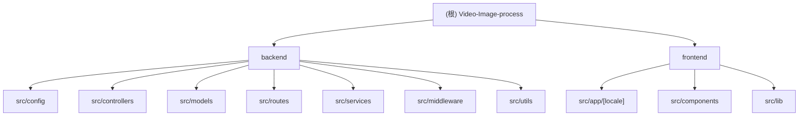

# Video & Image Processing Platform - AI 上下文文档

## 项目愿景

基于 FFmpeg 的专业视频图片处理平台，提供格式转换、压缩、裁剪、水印等 21 种丰富处理功能，支持多用户认证和响应式设计。

## 架构总览

这是一个前后端分离的全栈应用：
- **后端**: Node.js + Express + MySQL + FFmpeg
- **前端**: Next.js 14 + React 18 + TypeScript
- **认证**: JWT + Google OAuth 2.0
- **文件处理**: FFmpeg (云服务器部署)

## 模块结构图



## 模块索引

| 模块 | 路径 | 技术栈 | 主要职责 | 入口文件 |
|------|------|--------|----------|----------|
| 后端 | `backend/` | Node.js + Express + MySQL | 文件处理、用户认证、任务管理 | `src/server.js` |
| 前端 | `frontend/` | Next.js + React + TypeScript | 用户界面、文件上传、处理配置 | `src/app/[locale]/layout.tsx` |

## 运行与开发

### 环境要求
- Node.js >= 14.x
- MySQL >= 5.7
- FFmpeg >= 4.0

### 快速启动
```bash
# 后端
cd backend
npm install
npm run migrate
npm run dev

# 前端
cd frontend
npm install
npm run dev
```

### 数据库设置
```sql
CREATE DATABASE video_process_db CHARACTER SET utf8mb4 COLLATE utf8mb4_unicode_ci;
```

## 测试策略

### 功能测试
- 用户认证测试（邮箱密码 + Google OAuth）
- 视频处理测试（14 种功能）
- 图片处理测试（7 种功能）
- 移动端适配测试
- 错误处理测试

### 安全测试
- JWT Token 认证
- 文件类型验证
- SQL 注入防护
- 请求频率限制

### 性能测试
- 文件上传性能（< 30 秒/100MB）
- 视频处理性能（< 5 分钟/100MB）
- 并发处理能力

## 编码规范

### 后端规范
- 使用 CommonJS 模块
- 错误处理统一格式
- 数据库操作使用 Sequelize ORM
- 文件路径使用 path.join()

### 前端规范
- 使用 TypeScript 类型安全
- 组件化开发
- 状态管理使用 Zustand
- 表单验证使用 React Hook Form

### 安全规范
- 密码 bcrypt 加密
- JWT Token 认证
- 文件类型白名单验证
- 自动文件清理（24 小时）

## AI 使用指引

### 后端开发
- 新增视频处理功能：在 `src/services/ffmpegService.js` 添加方法
- 新增控制器：在 `src/controllers/` 创建文件
- 新增路由：在 `src/routes/` 创建文件

### 前端开发
- 新增页面：在 `src/app/[locale]/` 创建目录
- 新增组件：在 `src/components/` 创建文件
- API 调用：在 `src/lib/api.ts` 添加方法

### 数据库操作
- 新增模型：在 `src/models/` 创建文件
- 模型关联：在 `src/models/index.js` 定义
- 数据库迁移：使用 `src/config/migrate.js`

## 变更记录 (Changelog)

### 2025-10-29
- 初始化 AI 上下文文档
- 创建根级 CLAUDE.md
- 创建模块级 CLAUDE.md 文件
- 生成项目结构图
- 记录扫描覆盖率：50% (30/60 文件)

### 主要缺口
- 前端组件和页面未完全扫描
- 测试文件缺失
- 配置文件需要进一步检查

### 下一步建议
- 扫描剩余前端组件和页面
- 检查测试文件
- 审查配置文件
- 验证数据库迁移脚本